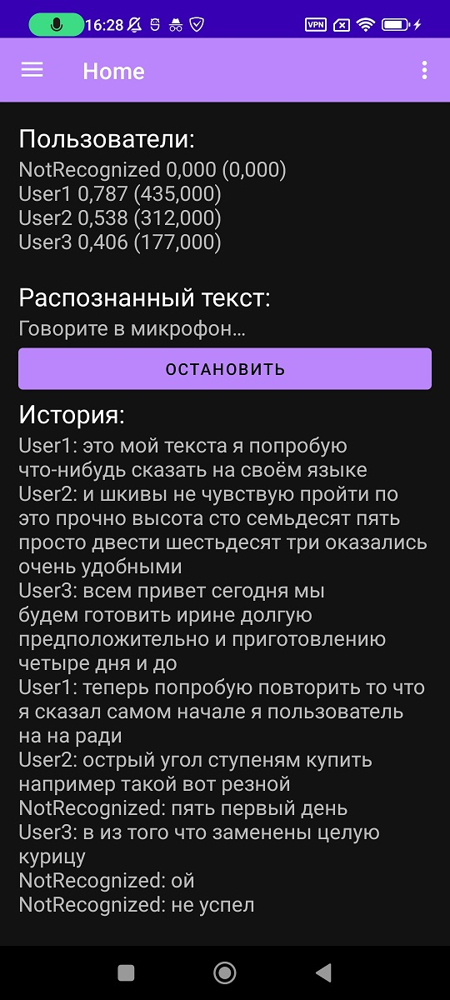

# Vosk Identification
Тестовый пример задействования модели для идентификации голоса с помощью библиотеки распознавания речи "Vosk" (Воск): https://alphacephei.com/vosk/

# Принцип работы
- Загружаем голосовую модель [vosk-model-small-ru-0.22](https://alphacephei.com/vosk/models/vosk-model-small-ru-0.22.zip)
- Загружаем идентификационную модель (подходит для всех языков) [vosk-model-spk-0.4](https://alphacephei.com/vosk/models/vosk-model-spk-0.4.zip)
- В папке с распакованной моделью создаем файл info.json для удобства.
- Для голосовой модели (uuid любой уникальный):

      {  
      "type":"voice",  
      "uuid" : "12904af4-5358-4735-bbb7-3aac7e0ebe67"  
      }  

- Для идентификационной модели (uuid любой уникальный):

      {  
      "type":"spk",  
      "uuid" : "11901af4-5358-4735-bbb7-3aac1e0ebe61"  
      }  

- Запускаем Recognizer
- В onResult(String hypothesis) к нам приходит текст, и массив векторов (идентификационный слепок голоса) **spk**, плюс количество фреймов **spk_frames**, эти данные мы отправляем в свою ViewModel
- Во вьюмодели добавляем нового "пользователя" (идентификационный слепок голоса spk) если его еще нет. Если уже есть пользовател(и) - рассчитываем "дистанцию" между пришедшими данными и каждым пользователем. Чем меньше "дистанция" между пользователем и пришедшими данными - тем больше вероятность что данные именно от этого пользователя.  
  Дистанция рассчитывается так ([Источник](https://github.com/alphacep/vosk-api/blob/12f29a3415e4967e088ed09202bfb0007e5a1787/python/example/test_speaker.py#L26) на языке python):

      def cosine_dist(x, y):    
        nx = np.array(x)  
        ny = np.array(y)  
        return 1 - np.dot(nx, ny) / np.linalg.norm(nx) / np.linalg.norm(ny)  

# Пример

На экране:  
NotRecognized - пользователь по умолчанию (не распознанный)  
User1 - мой голос  
User2 - голос со строительного канала https://www.youtube.com/watch?v=UbK6FLi7iMc  
User3 - голос обозревателя кино https://www.youtube.com/watch?v=QRcPa99aZh4

Качество распознавания ограничено моделью в 45Мб, поэтому на распознанном тексте можно сильно не акцентироваться.  
Для распознавания необходим чистый звук, не смешанный с другими голосами и фоновым шумом. Чем больше произнесено слов - тем лучше происходит идентификация. Слишком короткие фразы не идентифицируются (от модели не приходит массив векторов spk), и отображаются от имени пользователя NotRecognized.  
Если произнести предыдущую фразу на высоких тонах (изображая женский голос) - распознается как новый пользователь.  
Для реального использования предполагается что пользователь должен наговорить в микрофон пример своей речи, что-бы можно было сохранить этот идентификационный слепок голоса. И в дальнейшем сравнивать только с ним.